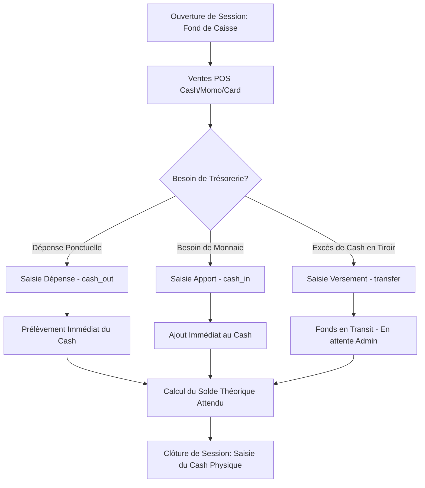
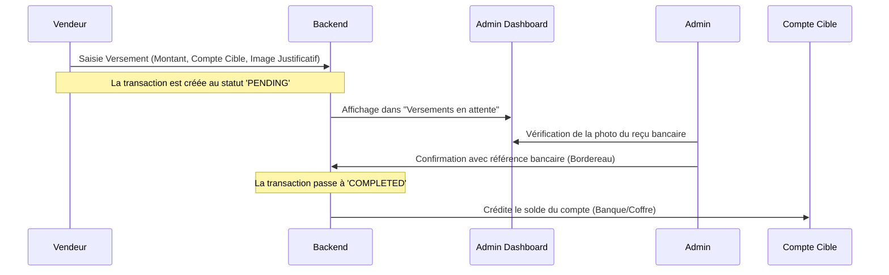

# Definitions, explications et fonctionnement des points de ventes, caisse, tresorerie

Ce document sert de guide de référence pour comprendre le fonctionnement de la gestion des points de ventes (POS), des sessions de caisse et de la trésorerie au sein du logiciel **Asklepios ERP**. Il détaille les concepts métiers, l'architecture technique, les flux de validation et les bonnes pratiques opérationnelles.

---

## 1. Définitions Métier

### A. Session de Caisse (Vendeur)
Une **Session de Caisse** représente l'intervalle de temps de travail d'un caissier physique (généralement une journée). 
*   **Ouverture** : La session commence avec un **fond de caisse initial** (espèces physiques allouées pour rendre la monnaie).
*   **Activité** : Enregistre toutes les ventes de médicaments ainsi que les mouvements de caisse manuels.
*   **Clôture** : À la fin du service, le caissier compte le cash physique réel dans le tiroir-caisse. Le logiciel compare ce montant au solde théorique calculé. Tout écart de caisse est historisé (positif ou négatif).

### B. Compte de Trésorerie (Poche d'argent)
Un **Compte de Trésorerie** (modélisé par la table `payment_accounts`) représente une "poche" physique ou virtuelle où dort l'argent de la pharmacie. Chaque compte est rattaché à une succursale spécifique. Il existe 4 types de comptes dans Asklepios :

*   **`safe` (Coffre-fort Interne)** : Représente le coffre physique blindé dans le bureau du gérant.
    *   *Cas d'usage* : Pour stocker temporairement le cash physique prélevé dans les caisses. C'est l'étape intermédiaire avant le dépôt en banque.
*   **`bank` (Banque)** : Représente le compte courant de la pharmacie dans une banque commerciale (ex: Afriland First Bank, SG, UBA...).
    *   *Cas d'usage* : Pour les versements bancaires par bordereau. C'est le compte de référence pour payer les fournisseurs de médicaments (grossistes).
*   **`mobile_money` (Mobile Money)** : Compte associé aux cartes SIM marchandes de l'officine (MTN MoMo, Orange Money).
    *   *Cas d'usage* : Pour centraliser les encaissements électroniques des clients ou pour transférer le MoMo accumulé par le caissier vers le gérant.
*   **`owner` (Compte Propriétaire / Gérant)** : Compte virtuel représentant le promoteur ou propriétaire de la pharmacie.
    *   *Cas d'usage* : Utilisé lorsque le propriétaire prend de l'argent de la caisse ou des comptes pour ses besoins privés ou des règlements directs, évitant ainsi d'avoir des écarts inexpliqués.

### C. Mouvements de Trésorerie (Transactions)
Un **Mouvement** (modélisé par la table `payment_transactions`) représente le déplacement de l'argent. Le système utilise 3 types de mouvements standardisés :
1.  **Apport (`cash_in`)** : Entrée d'argent manuelle externe (autre qu'une vente POS standard), comme l'ajout de monnaie par le gérant.
2.  **Dépense / Retrait (`cash_out`)** : Sortie d'argent définitive de la caisse pour des charges courantes (achat d'ampoules, savon, petites réparations).
3.  **Versement / Transfert (`transfer`)** : Déplacement de fonds d'un compte à un autre (ex: du tiroir-caisse vers le coffre-fort de la succursale, ou du coffre-fort vers le compte Afriland First Bank).

---

## 2. Fonctionnement des Flux Financiers

### A. Le Rôle du Caissier (Point de Vente)
Le caissier effectue ses opérations quotidiennes depuis son terminal de point de vente.

#### Équation Mathématique du Cash Attendu à la Clôture
Lors de la clôture, le système calcule automatiquement le solde théorique d'espèces devant se trouver dans le tiroir-caisse :
$$\text{Cash Attendu} = \text{Fond de Caisse Initial} + \text{Ventes Cash} + \text{Apports} - \text{Dépenses} - \text{Versements}$$

> [!NOTE]
> Même si un versement en banque est au statut **En transit (Pending)**, il est déduit immédiatement du tiroir-caisse du caissier, car l'argent n'est plus physiquement présent dans son tiroir lors de la fermeture de la session.

---

### B. Le Rôle de l'Administrateur (Validation & Suivi)
L'administrateur contrôle la trésorerie générale de toutes les succursales de la pharmacie.

#### Flux de Validation d'un Versement (Transfert)

1.  **Dépôt en transit** : Lorsque le caissier dépose $100\ 000\text{ XAF}$ en banque, le système enregistre la transaction en `pending`.
2.  **Rapprochement Bancaire** : Le comptable ou l'administrateur consulte l'interface **Versements**. Il vérifie la photo du bordereau jointe par le caissier.
3.  **Validation** : L'admin clique sur **Confirmer** et saisit le numéro de bordereau officiel. Le statut devient `completed` et le compte Afriland First Bank virtuel de la pharmacie est instantanément crédité.

---

## 3. Architecture Technique

### A. Base de Données
Les transactions de trésorerie sont enregistrées dans la table `payment_transactions` :

| Champ | Type | Description |
| :--- | :--- | :--- |
| `id` | BigInt (PK) | Identifiant unique. |
| `pharmacy_branch_id` | BigInt (FK) | Succursale émettrice. |
| `cash_register_session_id` | BigInt (FK) | Session de caisse active (uniquement pour les caissiers, NULL pour l'admin). |
| `type` | Enum | `cash_in`, `cash_out`, `transfer`. |
| `payment_method` | Enum | `CASH`, `MOBILE_MONEY`, `CARD`. |
| `amount` | Decimal(15,2) | Montant de la transaction. |
| `source_account_id` | BigInt (FK) | Compte d'origine (NULL si initié depuis la caisse du vendeur). |
| `destination_account_id`| BigInt (FK) | Compte cible (NULL pour les dépenses `cash_out`). |
| `status` | Enum | `pending`, `completed`, `cancelled`. |
| `reference` | String | Référence de la transaction (numéro de bordereau, ID de transaction mobile money). |
| `receipt_path` | String | Chemin du fichier scan/photo du justificatif sur le serveur. |
| `description` | Text | Motif de la transaction. |

---

## 4. Réponses aux Questions Pratiques

### Gérer la photo du bordereau sur un ordinateur de bureau (PC) ?
À la caisse d'une pharmacie, l'ordinateur de vente peut téléverser les justificatifs via :
1.  **Une webcam USB** : Directement connectée au PC de caisse, permettant de photographier le bordereau en un clic depuis le navigateur.
2.  **WhatsApp Web / Telegram** : Le caissier prend la photo avec son smartphone, l'envoie sur le groupe de l'officine et la glisse dans le navigateur.
3.  **Un scanner de bureau** : Scanner compact à défilement à côté de l'écran pour enregistrer l'image ou le PDF.

### Pourquoi lier la trésorerie aux succursales (Branches) ?
Même pour une pharmacie à compte unique, chaque succursale gère des flux physiques indépendants :
*   Le coffre-fort de la succursale de Douala n'est pas celui de Yaoundé.
*   Les comptes MTN / Orange Money sont généralement rattachés à des puces SIM physiques différentes détenues par chaque gérant de caisse.
*   La liaison par succursale permet à l'administrateur d'identifier immédiatement quelle caisse a déposé quel montant.

### Comment configurer les numéros Mobile Money ?
Pour que le système suive les règlements Mobile Money, l'administrateur crée un `PaymentAccount` de type `momo` par succursale, nommé par exemple :
*   *MTN Mobile Money - Caisse Principale (#123456)*
*   *Orange Money - Caisse Nuit (#654321)*

Lors du paiement ou du transfert, les fonds sont comptabilisés sur ces comptes, assurant une concordance parfaite avec les comptes téléphones réels.

---

## 5. Mode Sans Trésorerie (Flexibilité Client)
Si un pharmacien client ne souhaite pas utiliser les modules avancés de trésorerie (pas de validation bancaire, pas de coffre-fort virtuel) :
*   Il peut simplement ignorer la création des comptes bancaires virtuels.
*   Les caissiers continuent d'effectuer leurs ventes en espèces, Mobile Money et carte.
*   Le soir, ils ferment leur caisse normalement. Le système calcule l'attendu cash standard. Les dépenses urgentes peuvent toujours être saisies sans compte associé pour équilibrer la caisse.

---

## 6. Rapprochement et Écarts (Retraits Réels Hors Système)

### Le Problème
Dans le monde réel, il arrive que le propriétaire effectue des retraits d'espèces directement au guichet de la banque ou transfère des fonds depuis le compte Mobile Money de l'entreprise pour des besoins personnels (impôts, voyages, achats) **sans en informer immédiatement le système**. 
Le solde affiché dans le logiciel sera alors **supérieur** au solde réel de la banque ou du compte MoMo.

### La Solution : Le Rapprochement Manuel par l'Admin
Pour corriger cet écart et synchroniser le logiciel avec la réalité bancaire :
1.  **Réception du relevé bancaire** : À la fin du mois (ou de la semaine), le comptable/administrateur examine le relevé bancaire réel (ou l'historique Orange/MTN MoMo).
2.  **Identification de l'écart** : Il repère les lignes de débit réelles qui ne figurent pas dans Asklepios ERP (ex: un retrait carte ou un virement de 200 000 XAF).
3.  **Saisie d'ajustement dans Asklepios** :
    *   L'administrateur se rend sur l'onglet **Mouvements**.
    *   Il clique sur **Nouveau Mouvement** de type **Décaissement (`cash_out`)**.
    *   Il sélectionne le compte bancaire/MoMo concerné comme source, entre le montant de l'écart, et choisit comme motif *"Retrait Propriétaire"* ou *"Paiement impôts (Rapprochement bancaire)"*.
    *   *Résultat* : Le solde virtuel du compte dans Asklepios diminue immédiatement du montant saisi, ramenant la comptabilité du logiciel à 100% de concordance avec la réalité.

